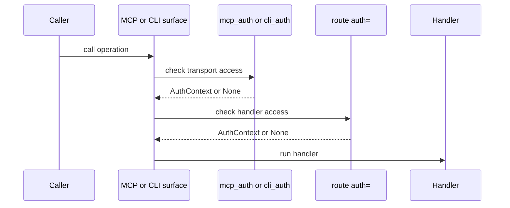

# Auth Model

This page explains how Quater separates route auth from MCP and CLI transport
auth.

## Prerequisites

Read [HTTP, MCP, and CLI Surfaces](/en/latest/surfaces). If you expose tools or
actions, read [Security](/en/latest/security) before deployment.

## The Rule

Quater has layered auth. Each layer answers a different question:

- `mcp_auth`: may this caller use the MCP transport?
- `cli_auth`: may this caller use the CLI action surface?
- route `auth=`: may this caller run this handler?

Quater does not collapse those layers because the surfaces have different risk.



HTTP routes skip surface auth and go directly to route `auth=` when it exists.

## A Runnable Example

```python
from quater import AuthContext, AuthRequest, Quater, Request


async def authenticate(ctx: AuthRequest) -> AuthContext | None:
    if ctx.headers.get("authorization") != "Bearer demo-token":
        return None
    return AuthContext(subject="user_123", metadata={"scope": "orders:read"})


app = Quater(mcp_auth=authenticate, cli_auth=authenticate)


@app.get("/me", tool=True, cli=True, auth=authenticate, description="Current user.")
async def me(request: Request) -> dict[str, object]:
    assert request.auth is not None
    return {
        "subject": request.auth.subject,
        "source": request.context.source,
    }
```

Missing auth returns:

```text
401 Unauthorized
Unauthorized
```

## Auth And Approval

Auth identifies the caller. Approval confirms one sensitive operation should run
for that caller and exact argument set.

Use `needs_approval=True` for dangerous mutations exposed through MCP or CLI:

```python
@app.patch(
    "/orders/{order_id}/status",
    tool=True,
    cli=True,
    auth=authenticate,
    needs_approval=True,
    description="Update one order status.",
)
async def update_order_status(order_id: str, status: str) -> dict[str, str]:
    return {"order_id": order_id, "status": status}
```

## What Can Go Wrong

`401 Unauthorized`
: The auth hook returned `None`. Check the token, header name, and route auth
policy.

`MCP tools require mcp_auth`
: A `tool=True` route exists without MCP transport auth.

`CLI actions require cli_auth`
: A `cli=True` route exists without CLI transport auth.

`needs_approval requires action_approval`
: A sensitive MCP or CLI operation exists without an approval hook.

## Also See

- [Security](/en/latest/security): production security details.
- [MCP Tools](/en/latest/mcp): MCP auth behavior.
- [Actions and CLI](/en/latest/actions): CLI auth and approval flows.
